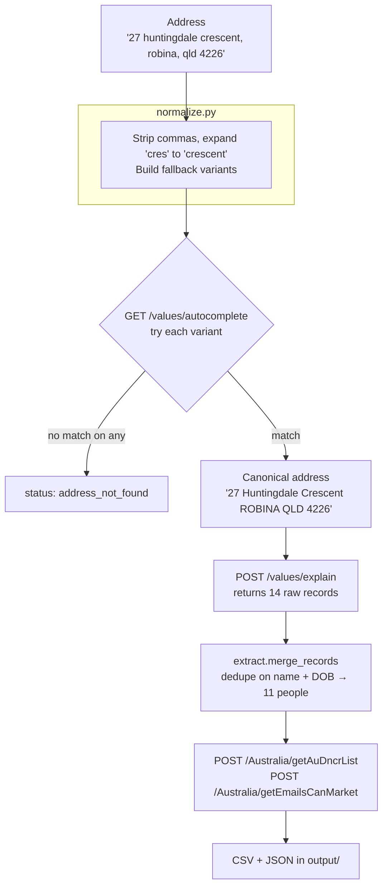

# ID4ME Address Lookup Automation

Automates the manual loop of typing an address into the
[ID4ME](https://id4me.me) dashboard, clicking search, and reading off the
occupant and contact details. Handles a single address or a whole day's list and
writes clean, deduplicated CSV.

**~1.3 seconds per address**, against roughly 20+ seconds doing it by hand.

> **Status:** working and verified end-to-end on 2026-08-13 against the live
> site. Before relying on it, read [Account status and legal
> position](#account-status-and-legal-position) — there are two live caveats.

---

## Table of contents

1. [Quick start](#quick-start)
2. [How it works](#how-it-works)
3. [Setting up from scratch](#setting-up-from-scratch)
4. [Command reference](#command-reference)
5. [Input format](#input-format)
6. [Output format](#output-format)
7. [Deduplication: what gets merged and why](#deduplication-what-gets-merged-and-why)
8. [The ID4ME API](#the-id4me-api)
9. [Gotchas that fail silently](#gotchas-that-fail-silently)
10. [Troubleshooting](#troubleshooting)
11. [Re-discovering the site if it changes](#re-discovering-the-site-if-it-changes)
12. [File map](#file-map)
13. [Account status and legal position](#account-status-and-legal-position)

---

## Quick start

```bash
cd /Users/projects/Documents/Fetcha_Addresses/01_ID4ME

# one address
python3 lookup.py "27 huntingdale crescent, robina, qld 4226"

# a day's list
python3 lookup.py --batch addresses.csv

# is the account healthy?
python3 lookup.py --status
```

Output lands in `output/` as a timestamped pair: `.csv` (flat, one row per
person) and `.json` (everything, including the raw API records).

Expected result for the address above: **14 raw records → 11 unique people**.
That is the regression test — if you get 7, see
[gotchas](#gotchas-that-fail-silently).

---

## How it works

ID4ME's dashboard is a React/MUI single-page app sitting on a plain JSON API.
This tool **calls that API directly** instead of driving a browser, which is both
far faster and immune to the site being restyled.



Two independent paths exist:

| Path | Entry point | Use |
|---|---|---|
| **API** (primary) | `lookup.py` | Everyday use. Fast, stable. |
| **Browser** (fallback) | `id4me_bot.py` | Login, site discovery, and a working UI-driving scraper if the API ever changes shape. |

### Authentication

Auth0 — tenant `id4me.au.auth0.com`, OAuth2 with PKCE, audience
`" Id4me-search-v2"` (**the leading space is real and required**).

`api.get_bundle()` resolves credentials by the cheapest route that works:

1. **Cached token** in `.token.json`, if unexpired (2-hour lifetime, 120s safety
   margin).
2. **HTTP refresh** using the stored refresh token — the app requests
   `offline_access`, so a refresh token is available. No browser involved.
3. **Headless browser login** as a last resort: signs in with `.env` credentials
   and harvests both the access token and the `sessionid` out of the page.

A normal day never launches Chrome. On a `401` mid-run, `Id4meClient._request`
re-authenticates and retries once, so long batches survive token expiry.

---

## Setting up from scratch

### Prerequisites

Verified against Python 3.14.2, `requests` 2.32.5, Playwright 1.57.0 on
macOS (Darwin 24.3.0, Apple Silicon).

```bash
pip3 install requests playwright
python3 -m playwright install chromium
```

Playwright is only needed for the browser fallback and the one-time token
harvest; `requests` does all the routine work.

### Credentials

Create `.env` in this directory (gitignored):

```
ID4ME_EMAIL=will@fieldsestate.com.au
ID4ME_PASSWORD=your-password
```

`api.py` reads it via `id4me_bot.load_credentials()`, which also accepts the
same names as real environment variables.

### First run

```bash
python3 lookup.py --status
```

This triggers the full auth chain. With no cache present it launches headless
Chrome, logs in, saves `.token.json`, and prints the account summary. Every
later run reuses that cache.

If automated login fails (MFA, changed password, Auth0 lockout), sign in by
hand once — the session persists in `.chrome_profile/`:

```bash
python3 id4me_bot.py login
```

### Why a separate Chrome profile

Chrome 136+ (currently 151) refuses `--remote-debugging-port` against your
default user profile as a security measure, so automation **cannot attach to
your everyday Chrome window** — this was the first thing established when
building it. The browser path therefore runs its own persistent profile in
`.chrome_profile/`. Your normal browser is never touched.

---

## Command reference

### `lookup.py` — the day-to-day tool

```
python3 lookup.py [address] [--batch CSV] [--out PATH]
                  [--no-compliance] [--delay SECONDS] [--status]
```

| Flag | Effect |
|---|---|
| *(positional)* | A single address to look up |
| `--batch CSV` | Look up every address in a CSV |
| `--out PATH` | Write the CSV somewhere specific instead of `output/` |
| `--no-compliance` | Skip DNCR and email-marketability calls (2 fewer API calls per address) |
| `--delay N` | Seconds between batch lookups. Default `1.0` |
| `--status` | Print account/subscription state and exit |

Exit codes: `0` at least one address resolved · `1` none resolved ·
`2` authentication failed.

### `id4me_bot.py` — browser fallback and discovery

```
python3 id4me_bot.py login [--wait 300]        # interactive sign-in
python3 id4me_bot.py status [--headless]       # is the stored session alive?
python3 id4me_bot.py discover dom [--url URL]  # dump DOM + screenshot + inventory
python3 id4me_bot.py discover watch [-s 120]   # record API calls while you search by hand
python3 id4me_bot.py search "<address>" [--headless] [--screenshot]
python3 id4me_bot.py batch addresses.csv [--headless]
```

`search`/`batch` here drive the real UI. They are slower and only needed if the
API path breaks.

---

## Input format

`addresses.csv` — a header plus one address per line:

```csv
address
27 huntingdale crescent, robina, qld 4226
14 example street, southport, qld 4215
```

All of these parse correctly (tested):

- single column with header, commas **unquoted**
- single column, **no header**
- single column, quoted
- multi-column, e.g. `address,notes` (uses the `address` column)

---

## Output format

One row per unique person, `extract.CSV_COLUMNS`:

| Group | Columns |
|---|---|
| Query | `address_searched`, `matched_address`, `result_count` |
| Identity | `full_name`, `first_name`, `middle_name`, `surname`, `title`, `date_of_birth`, `gender` |
| Contact | `mobiles`, `landlines`, `emails` — semicolon-separated when several |
| Compliance | `dncr_blocked`, `dncr_detail`, `emails_marketable` |
| Location | `suburb`, `state`, `postcode`, `gnaf_pid`, `latitude`, `longitude` |
| Provenance | `source_date_latest`, `record_ids` |

`gnaf_pid` is the national GNAF property identifier (e.g. `GAQLD157092377`), so
results join directly against the other property datasets in this repo.

Rows are ordered **newest source date first**, so current occupants come before
historical ones.

### Result statuses

Found in the JSON, and in the CSV's `matched_address` column when a lookup
returns nobody:

| Status | Meaning |
|---|---|
| `ok` | Address resolved, people found |
| `address_not_found` | Autocomplete matched nothing on any variant |
| `no_results` | Address resolved but held no records |
| `auth_error` | Could not authenticate — check `.env` |
| `error` | Anything else; see the `error` field |

A failed address still gets a placeholder CSV row, so a miss is visible in the
spreadsheet rather than silently absent.

---

## Deduplication: what gets merged and why

ID4ME returns **one row per source record, not per person**. The same individual
appears repeatedly with different fragments attached — one row carries their
mobile, another their email.

`extract.merge_records()` merges on **(normalised full name, date of birth)**,
unions phones/emails, and keeps the newest `source_date`.

The merge is **deliberately conservative**. Real results routinely contain
several names sharing one birthday — the shape of the problem, with names
changed:

```
Margaret Example   b.1975-03-22
M Jane Example     b.1975-03-22
Maggie Example     b.1975-03-22
Marcus Example     b.1975-03-22
```

The first three are plausibly one person under name variants; the fourth looks
like a different person who happens to share the date. Merging on DOB alone
would collapse all four into one, inventing a person who does not exist. So name
variants stay separate — **a human should make that call**, and sorting by
`date_of_birth` in the spreadsheet groups the candidates for review.

A single address also commonly returns several eras of residents, which is why
provenance matters. The test address returns three:

| Era | `source_date` |
|---|---|
| Current occupants | 2024-06-05 |
| Previous | 2018 – 2023 |
| Historical | 2001-04-01 |

Sort or filter on `source_date_latest` to isolate the current household.

---

## The ID4ME API

Base: `https://id4me-search-prod-api.azurewebsites.net/api`

### Required headers

Every request needs **all** of these:

```http
Authorization: Bearer <auth0-access-token>
sessionid: <uuid from the id4me_session_id cookie>
Accept: application/json, text/plain, */*
Content-Type: application/json
Origin: https://id4me.me
Referer: https://id4me.me/
```

### `GET /values/autocomplete`

Resolves free text to a canonical address.

```
?term=27+huntingdale+crescent+robina&indexToUse=search-au
```

```json
{"success": true,
 "data": [{"type": "address", "value": "27 Huntingdale Crescent ROBINA QLD 4226"}]}
```

Entries have a `type` — filter for `"address"`.

### `POST /values/explain`

The search itself. Elasticsearch-backed.

```json
{
  "page": 0,
  "size": 50,
  "request": [
    {"id": 0, "command": "index", "arg": "AU"},
    {"id": 1, "command": "query", "arg": "27 Huntingdale Crescent ROBINA QLD 4226"}
  ],
  "indexToUse": "search-au"
}
```

Response keys: `data` (the records), `Total`, `status` (a human string like
`"Approximately 14 records found..."`), `more`, `query` (the generated ES query),
`guess`, `keys`.

Useful per-record fields:

| Field | Notes |
|---|---|
| `full_name`, `gn_1_1`, `gn_1_2`, `sn_1_1`, `t_1_1` | Name, given 1/2, surname, title |
| `dateofbirth_1_dt`, `gender` | ISO datetime; `M`/`F` |
| `phone1_landline`, `phone2_mobile` | |
| `emailaddress` | |
| `ad1`, `ad2`, `full_address`, `suburb`, `state`, `postcode` | **`full_address` is wrapped in `<em>` highlight tags** — strip them |
| `gnaf_pid` | National GNAF property ID |
| `location` | `"lat,long"` in one string |
| `source_date_dt` | When ID4ME last saw this record |
| `id` | SHA-style record hash |

Pass `page`/`size` for pagination; `size: 50` matches the UI default.

### `POST /Australia/getAuDncrList`

Do Not Call Register. Body is a bare JSON array of digit-only phone numbers.

```json
["0755000000", "0410000000"]
```

```json
[{"phone": "0755000000", "dncr_status": "Y", "dncr_date": "2019-04-11",
  "Found": true, "Ping": {"PingStatus": "Connected", "PingDate": "2025-05-12"},
  "Message": "DNCR Status: Cannot Call (11/04/2019)"}]
```

`dncr_status: "Y"` means **do not call**.

### `POST /Australia/getEmailsCanMarket`

Body is a bare JSON array of emails; returns `[{"email": ..., "canMarket": bool}]`.

### `GET /account/profile`

Auth0 profile. Note the shape differs from the copy the SPA keeps in
localStorage — subscription details live under `user_metadata`:

```json
{"email": "...", "name": "...", "smart_search_enabled": true, "blocked": false,
 "user_metadata": {"financial_expiry": "2026-08-16T01:06:54Z",
                   "subscription_status": "subscribed",
                   "subscription_plan": "month"}}
```

### Auth0 refresh

```http
POST https://id4me.au.auth0.com/oauth/token
{"grant_type": "refresh_token",
 "client_id": "bX1SwoGPtCO0WdrnpR4w0xXnDD97s3HE",
 "refresh_token": "...",
 "audience": " Id4me-search-v2",
 "scope": "openid profile email offline_access"}
```

---

## Gotchas that fail silently

**These are the ones that cost real debugging time.** Each produces a
wrong-but-plausible result rather than an error, so nothing alerts you.

### 1. The `sessionid` header is mandatory

Omit it and the API returns **HTTP 200 with an empty result set**. It looks
exactly like "this address has no records"; it is actually an incomplete
authentication. A valid bearer token alone is not enough.

The value comes from the `id4me_session_id` cookie (also mirrored in
localStorage under `ajs_user_traits.sessionId`). It is harvested by
`api._read_session_id()` and cached alongside the token — including **across
token refreshes**, since Auth0 does not issue it.

### 2. Commas break autocomplete

```
"27 huntingdale crescent, robina, qld 4226"  →  []
"27 huntingdale crescent robina qld 4226"    →  match
```

`normalize.clean()` strips commas and full stops.

### 3. Abbreviated street types break autocomplete

```
"27 huntingdale cres"      →  []
"27 huntingdale crescent"  →  match
```

`normalize.STREET_TYPES` expands 28 common abbreviations (`cres`, `st`, `rd`,
`ave`, `tce`, `pde`…). `normalize.variants()` then produces progressively looser
fallbacks — full string, minus postcode, minus state — tried in order.

### 4. Unquoted commas in your input CSV

The one that produced genuinely wrong output. A hand-written one-address-per-line
file does not quote the commas inside an address, so a naive `csv.reader` shreds

```
27 huntingdale crescent, robina, qld 4226
```

into four fields. Reading "the first column" then searches only
`27 Huntingdale Crescent`, which **returns 7 people instead of 11** — a
plausible-looking result that is quietly wrong.

`lookup.read_addresses()` rejoins single-column rows with commas intact. If you
ever refactor it, keep that behaviour.

### 5. MUI tooltips swallow Playwright clicks (browser path only)

On the search page a `MuiTooltip` popper overlays the mode menu; `locator.click()`
times out after 45s with *"intercepts pointer events"*. Click those items via
`page.evaluate` instead. `selectors.json` records this under `_site_notes`.

### 6. MUI element ids are regenerated per render

The search box appears as `id="_r_7_"`. **Never select on it.** Use
`input[type=search][role=combobox]`.

---

## Troubleshooting

| Symptom | Likely cause | Fix |
|---|---|---|
| Every address → `address_not_found` | Missing/stale `sessionid` | `rm .token.json` and rerun to re-harvest |
| `auth_error`, or login loops | Wrong password in `.env`; possible Auth0 lockout | Verify by hand at id4me.me. **Do not retry repeatedly** — Auth0 blocks after ~10 failures |
| Results look thin (7 not 11) | Input CSV commas being split | See [gotcha 4](#4-unquoted-commas-in-your-input-csv) |
| `401` on every call | Refresh token revoked | `rm .token.json`, then `python3 id4me_bot.py login` |
| Everything fails after 2026-08-16 | Subscription lapsed | `python3 lookup.py --status` |
| Compliance fields empty, contacts fine | Enrichment call failed; deliberately non-fatal | See the `error` field in the JSON |
| Browser path times out on a click | MUI tooltip interception | See [gotcha 5](#5-mui-tooltips-swallow-playwright-clicks-browser-path-only) |

Reset sequence, least to most destructive:

```bash
python3 lookup.py --status          # check auth + subscription
rm .token.json                      # force full re-auth (safe)
rm -rf .chrome_profile              # discard the saved browser session
python3 id4me_bot.py login          # sign in by hand again
```

---

## Re-discovering the site if it changes

This is exactly how the API above was mapped — repeat it if ID4ME changes
anything.

```bash
# 1. What does the page look like now?
python3 id4me_bot.py discover dom
#    → discovery/dom_*.html, inventory_*.json (every input/button/form), screen_*.png

# 2. What calls does a real search make?
python3 id4me_bot.py discover watch -s 120
#    Opens a visible browser; do ONE search by hand. Records every request,
#    then snapshots the results DOM.
#    → discovery/network_*.json, results_dom_*.html
```

Then inspect `discovery/network_*.json` for non-analytics XHR. Two tips learned
the hard way:

- **Filter out the noise.** Google/DoubleClick/HubSpot/Segment/Appcues chatter
  swamps the real calls. `discover.py` skips images, fonts and stylesheets;
  filter hostnames too.
- **Guard `request.post_data`.** It raises `UnicodeDecodeError` on gzipped
  bodies, and inside a Playwright event handler that exception kills the whole
  run. Wrap every accessor in `try/except`.

Update `selectors.json` (browser path) or the constants at the top of `api.py`
(API path) with whatever you find. `selectors.json` needs no code changes —
each key is an ordered candidate list, first visible match wins.

---

## File map

| File | Purpose |
|---|---|
| `lookup.py` | **Main tool.** CLI, orchestration, CSV/JSON output |
| `api.py` | API client: token lifecycle, all endpoints |
| `normalize.py` | Address cleaning, abbreviation expansion, fallback variants |
| `extract.py` | Dedupe/merge, compliance flags, CSV shaping |
| `id4me_bot.py` | Browser path: `login`, `status`, `discover`, `search`, `batch` |
| `browser.py` | Persistent-profile Chrome lifecycle |
| `discover.py` | DOM and network capture tooling |
| `selectors.json` | Browser-path selectors + site notes. Edit here, not in code |
| `config.py` | Paths, URLs, timeouts, batch pacing |
| `addresses.csv` | Input template |
| `output/` | Results (gitignored) |
| `discovery/` | Site snapshots (gitignored) |

Generated at runtime, all gitignored: `.env`, `.token.json`, `.chrome_profile/`,
`credentials.txt`.

---

## Account status and legal position

**Read this before scaling up.**

- **Subscription expiry.** As of 2026-08-13 the account expires
  **2026-08-16** (`user_metadata.financial_expiry`). Everything stops working
  then. `--status` warns within 14 days.

- **`can_use_api` is `false` on this account.** ID4ME sells API access as a
  separate licensed product. What this tool uses are the *internal endpoints the
  web app itself calls* — functionally identical to using the dashboard, but not
  the licensed API product. **Automated access may sit outside the subscription
  terms; this has not been confirmed with ID4ME.** Worth checking the agreement
  before running at volume, or asking them what the official API costs — that
  would give a supported contract instead of endpoints that can change without
  notice.

- **Personal data.** Output contains names, dates of birth, phone numbers and
  email addresses of real people. Australian Privacy Act obligations apply to
  how it is stored, used and disclosed. `output/`, `discovery/`, `.env`,
  `.token.json`, `credentials.txt` and `.chrome_profile/` are all gitignored —
  verified with `git check-ignore`. Keep it that way.

- **Do Not Call Register.** Several numbers at the test address return
  *Cannot Call*. Check `dncr_blocked` before phoning; contacting a registered
  number can attract penalties.

- **Be a good citizen.** Batches pace at 1s per address (`--delay`). Do not
  remove it.
